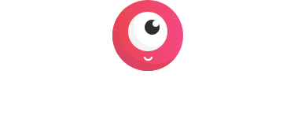

Consiste em um jogo infantil que converte as letras em símbolos para que as crianças descubram a mensagem.

O código foi desenvolvido em um workshop do [Laracast](https://laracasts.com/series/code-breaking-workshop).

Tecnologias utilizadas:
- Stack TALL: Tailwind, Alpine, Laravel & Livewire,
- Docker e DevContainer para conteinerizar a aplicação e o banco de dados;

